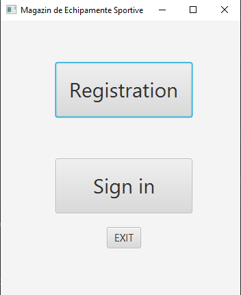

# MagazinEchipamenteSportive

A JavaFX Application demonstrating how to implement a simplistic approach of a registration use case using the following technologies:
* Java 15
* JavaFX (as GUI)
* Maven (as build tools)
* Nitrite Java (as Database)

## Setup & Run
To set up and run the project locally on your machine, please follow the next steps.

### Clone the repository
Clone the repository using:
```git
git clone https://github.com/fis2021/MagazinEchipamenteSportive
```

### Verify that the project Builds locally
Open a command line session and `cd MagazinEchipamenteSportive`.
If you have installed all the prerequisites, you should be able to run any of the following command:
```
mvn clean install

```
If you prefer to run using the wrappers, you could also build the project using 
```
./mvnw clean install (for Linux or MacOS)
or 
mvnw.cmd clean install (for Windows)

### Open in IntelliJ IDEA
To open the project in IntelliJ idea, you have to import it as a Maven project. 
After you import it, in order to be able to run it, you need to set up your IDE according to the [official documentation](https://openjfx.io/openjfx-docs/). Please read the section for `Non-Modular Projects from IDE`.
If you managed to follow all the steps from the tutorial, you should also be able to start the application by pressing the run key to the left of the Main class.

### Run the project with Maven 
The project has already been setup for Maven according to the above link.
To start and run the project use the following commands:
* `mvn javafx:run` or `./mvnw javafx:run` (run the `run` goal of the `javafx` maven plugin)

You should see an application starting, that looks like this:



Try and register a user, for example admin, with the admin password. It will tell you, the user was registered successfully.


However, if you try to register a user with the same username again, you will see an error message:


