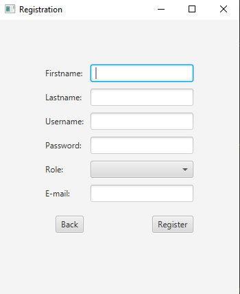
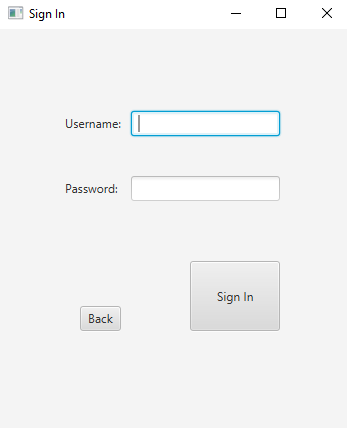
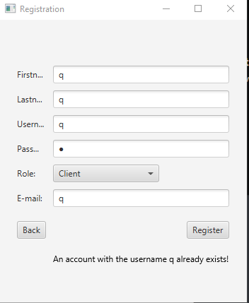
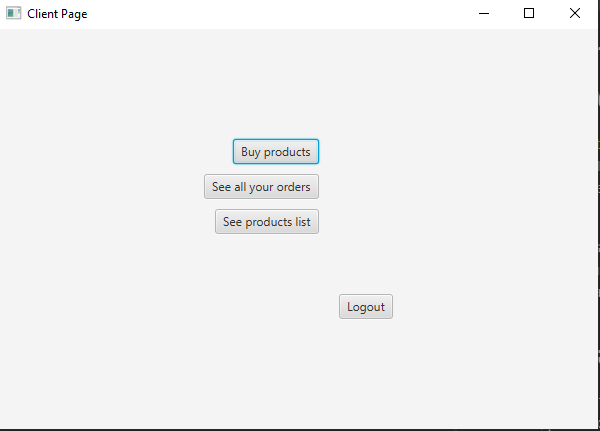

# <div align="center"> MagazinEchipamenteSportive </div>

A JavaFX Application demonstrating how to implement a simplistic approach of a registration use case using the following technologies:
* Java 15
* JavaFX (as GUI)
* Maven (as build tools)
* Nitrite Java (as Database)

## <i>Setup & Run</i>
To set up and run the project locally on your machine, please follow the next steps.

### <i>Clone the repository</i>
Clone the repository using:
```git
git clone https://github.com/fis2021/MagazinEchipamenteSportive
```

### <i>Verify that the project Builds locally</i>
Open a command line session and `cd MagazinEchipamenteSportive`.
If you have installed all the prerequisites, you should be able to run any of the following command:
```
mvn clean install

```
If you prefer to run using the wrappers, you could also build the project using 
```
./mvnw clean install (for Linux or MacOS)
or 
mvnw.cmd clean install (for Windows)

```
### <i>Open in IntelliJ IDEA</i>
To open the project in IntelliJ idea, you have to import it as a Maven project. 
After you import it, in order to be able to run it, you need to set up your IDE according to the [official documentation](https://openjfx.io/openjfx-docs/). Please read the section for `Non-Modular Projects from IDE`.
If you managed to follow all the steps from the tutorial, you should also be able to start the application by pressing the run key to the left of the Main class.


## <i>Run the project with Maven</i> 
The project has already been setup for Maven according to the above link.
To start and run the project use the following commands:
* `mvn javafx:run` or `./mvnw javafx:run` (run the `run` goal of the `javafx` maven plugin)

You should see an application starting, that looks like this:


Try to click on registration button a user. After that you will see the next page which looks like this:



Now try and register an account with your details. If the username is not already used then you should be able to see the Sign in page whick looks like this:



However, if you try to register a user with the same username again, you will see an error message:



If you sign in as a client, you should see the next page:



### <i>The Client Account</i>

<b>As a client</b>, you can see products list .

<b>As a client</b>, you can buy products.

<b>As a client</b>, you can see your orders.

<b>As a client</b>, you can log out.


If you sign in as a manager, you should see the next page:


### <i>The Manager Account</i>

<b>As a manager</b>, you can see products list .

<b>As a manager</b>, you can add products.

<b>As a manager</b>, you can edit products.

<b>As a manager</b>, you can delete products.

<b>As a manager</b>, you can see all orders.

<b>As a manager</b>, you can see the client details.

<b>As a manager</b>, you can log out.
